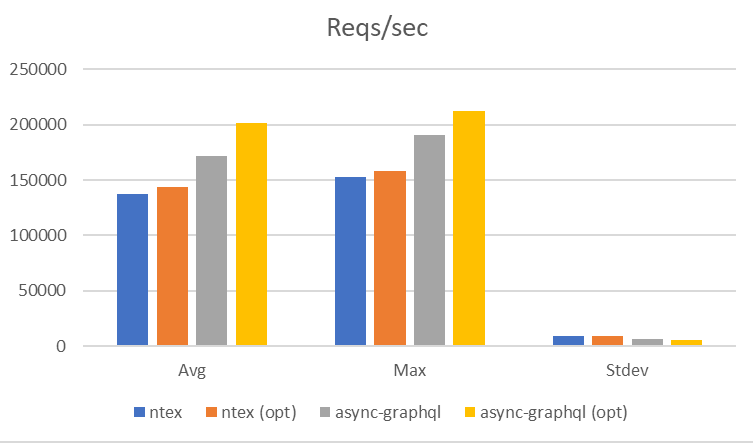
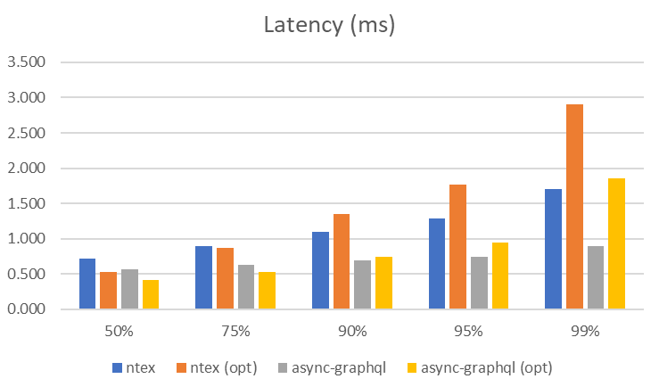

### GraphQL Server

This is a graphql server based on ntext and juniper.

## Usage

### server
Build on release mode
```bash
cargo build --release
```

Run graphql server
```
./target/release/graphqlserver
```

### Performance test
Using [bombardier](https://github.com/codesenberg/bombardier), execute the following command:

```
bombardier -m POST -c 100 -n 10000000 -l -p r http://127.0.0.1:8080/graphql -H "Content-Type: application/json" -b '{"query":"{\n  test {\n    id\n  }\n}\n","variables":null}'
```
The command above performs 10000000 request(s) using 100 connection(s)

* -c number of conect
* -n number of requests

Using :herb: __master__ (use ntex as web framework) here the results:

|Statistics|Avg|Stdev|Max|
|---|---|---|---|
|Reqs/sec|137164.04|8669.19|152667.20|
|Latency |723.53us |39.92us|14.82ms|

|Latency| Distribution|
|---|---|
|50%|714.00us|
|75%|0.90ms|
|90%|1.10ms|
|95%|1.29ms|
|99%|1.70ms|

|HTTP codes|
|--|
|1xx - 0|
|2xx - 10000000|
|3xx - 0|
|4xx - 0|
|5xx - 0|
|others - 0|

|Throughput|
|--|
|41.72MB/s|


Using :herb: __async-graphql__ (use async-graphql and actix-web as web framework) here the results:

|Statistics|Avg|Stdev|Max|
|---|---|---|---|
|Reqs/sec|171297.20|6342.20|190835.46|
|Latency |578.37us|106.54us|44.67ms|

|Latency| Distribution|
|---|---|
|50%|569.00us|
|75%|632.00us|
|90%|691.00us|
|95%|740.00us|
|99%|  0.89ms|

|HTTP codes|
|--|
|1xx - 0|
|2xx - 10000000|
|3xx - 0|
|4xx - 0|
|5xx - 0|
|others - 0|

|Throughput|
|--|
|50.96MB/s|


After the following optimizations in the cargo.toml file:

```
[profile.release]
opt-level = 3
lto = true
codegen-units = 1
strip = true
```
the command to build is:

```
RUSTFLAGS="-C target-cpu=native" cargo build --release
```

using :herb: __master__, here the results:

|Statistics|Avg|Stdev|Max|
|---|---|---|---|
|Reqs/sec |143285.95 | 9002.55  |157950.36|
|Latency  | 683.83us |132.96us  |  18.81ms|


|Latency| Distribution|
|---|---|
|50%| 523.00us|
|75%|   0.87ms|
|90%|   1.35ms|
|95%|   1.77ms|
|99%|   2.91ms|

|HTTP codes|
|--|
|1xx - 0|
|2xx - 10000000|
|3xx - 0|
|4xx - 0|
|5xx - 0|
|others - 0|

|Throughput|
|--|
|43.58MB/s|


using :herb: __async-graphql__, here the results:

|Statistics|Avg|Stdev|Max|
|---|---|---|---|
|Reqs/sec |201282.43   | 5372.76  |212429.82|
|Latency  | 491.16us   |277.21us  |  31.39ms|

|Latency| Distribution|
|---|---|
|50% |415.00us|
|75% |530.00us|
|90% |742.00us|
|95% |  0.95ms|
|99% |  1.86ms|

|HTTP codes|
|--|
|1xx - 0|
|2xx - 10000000|
|3xx - 0|
|4xx - 0|
|5xx - 0|
|others - 0|

|Throughput|
|--|
|59.90MB/s|




